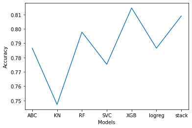

# Titanic-Project
## Overview
The goal of this project is to build a classifier model that can accuratly predict whether a passenger survived the Titanic.
1. Cleaning the Data
    * used different techniques to fill in missing values. For example for ages I used regex to extract a persons sur nname and used the mean of that to fill in the missing values
2. EXplore the Data
    * got a better understanding of the important features and also the features that could be dropped.
    * removed some outliers
    * the graph below shows how being a female and in first class gave you a better chance of surviving

3. Feature Engineering
    * Created interesting features 
4. Built the models
    * discovered that the XGB classifier gave the best accuracy after tuning the parameters
    

